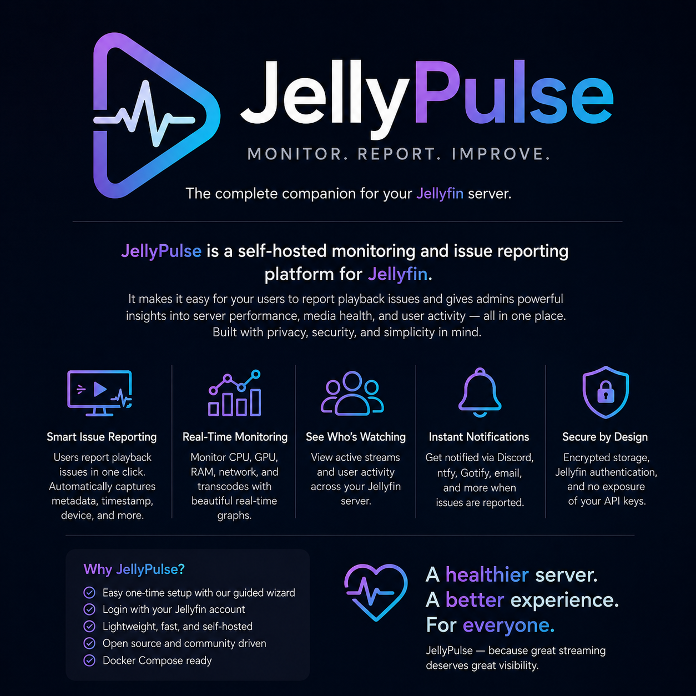

# JellyPulse

<p align="center">
  
</p>

**MONITOR · REPORT · IMPROVE**

The all-in-one operations dashboard for Jellyfin. Monitor server health, track active viewers, collect playback issues, and keep your media library running smoothly - all from one lightweight, self-hosted application.

Current release: **v1.1.0** · See [CHANGELOG.md](CHANGELOG.md) for release history.

## Features

- First-run setup assigns one existing Jellyfin user as the JellyPulse administrator, alongside the Jellyfin server URL/API key.
- After first-run setup completes, JellyPulse returns to the login screen so the administrator signs in through the same Jellyfin flow as every other user.
- **Login with Jellyfin** for every user. Passwords are passed only to Jellyfin for authentication and are never stored here.
- Server-side session cookies (`HttpOnly`, `SameSite=Strict`) and AES-256-GCM encrypted API keys, notification credentials, and Jellyfin session tokens in PostgreSQL.
- Playback polling every 30 seconds; the user's latest session is retained for five minutes after it stops.
- Reports containing the user, item details, device/client, playback timestamp, issue type/description, open/resolved state, submission time, and the preceding five minutes of Jellyfin container metrics.
- Admin dashboard with active/recent viewers, CPU history, a recent issue queue, resolution control, and multiple notification destinations.
- Revocable pre-authenticated reporting links with optional expiration. Raw 256-bit link tokens are shown once and only SHA-256 hashes are stored; link sessions never receive administrator access.

### Private reporting links

An administrator can create a private link for any enabled Jellyfin user from the dashboard. The user can bookmark that link and open it instead of entering a password. Tokens are placed in the URL fragment so they are not sent in HTTP request paths or referrer headers. Treat each link like a password: send it privately, give shared-device links an expiration date, and revoke a link immediately if it is exposed. Disabling the Jellyfin user also prevents the link from being used.

### Notification destinations

JellyPulse can notify multiple destinations for every submitted issue. Supported providers are Home Assistant, SMTP email, Discord, Slack, ntfy, Gotify, Telegram, Pushover, generic JSON webhooks, and an Apprise API bridge for additional services. Each destination can be edited in a popup, tested, disabled, or deleted independently. Existing secrets stay encrypted when an edit field is left blank; credentials are never returned to the browser after saving.

For Home Assistant, create a long-lived access token from the Home Assistant user profile and enter the `notify` service suffix, such as `mobile_app_your_phone`. JellyPulse calls `/api/services/notify/{service}`. For email, use the SMTP values supplied by the mail provider. Apprise users can connect a separately deployed Apprise API instance and provide one or more Apprise notification URLs; Apprise API is not bundled in this Compose stack.

## Requirements

- Docker Engine or Docker Desktop with Docker Compose v2.
- A Jellyfin server reachable from the JellyPulse container.
- A dedicated Jellyfin API key and an existing Jellyfin user to designate as the JellyPulse administrator.
- Git if installing or updating from GitHub.
- Optional: Jellyfin on the same Docker host if you want container CPU/RAM collection.

## Install

1. Clone the repository and enter it:

   ```sh
   git clone https://github.com/SleepingPanda4/JellyPulse.git /opt/jellypulse
   cd /opt/jellypulse
   ```

2. Copy `.env.example` to `.env` and replace both secret values:

   ```sh
   cp .env.example .env
   nano .env
   ```

   `POSTGRES_PASSWORD` may contain special characters; wrap the value in single quotes in `.env` if it contains `$`, `#`, whitespace, or other Compose-sensitive characters. Generate the encryption key with:

   ```sh
   openssl rand -base64 32
   ```

3. From this directory, run:

   ```sh
   docker compose up -d --build
   ```

   Docker waits for PostgreSQL to pass its health check before starting JellyPulse. To see startup state, run `docker compose ps`.

4. On the host machine, open `http://localhost:3000` and complete setup. Use the SSH-tunnel or temporary LAN instructions below when Docker is running on a remote LXC/server.

The service binds to `127.0.0.1` by default. This deliberately means it is not accessible from another device until you use an SSH tunnel or place it behind HTTPS (for example Caddy, Nginx Proxy Manager, or a private VPN such as Tailscale). Set `SESSION_COOKIE_SECURE=true` when HTTPS is enabled.

## First-run setup

The setup wizard asks for:

- The Jellyfin base URL as seen from the JellyPulse container, such as `http://10.10.10.50:8096` or `https://jellyfin.example.com`. Do not use a browser `/web` URL.
- A dedicated Jellyfin API key created under Jellyfin Dashboard → Advanced → API Keys.
- The username and password of the existing Jellyfin account that should administer JellyPulse. The password verifies the selection but is never stored.

After setup completes, JellyPulse returns to **Login with Jellyfin**. The selected account receives the administrator dashboard; other Jellyfin accounts receive the reporting page.

## Accessing the dashboard

With the default `APP_BIND_ADDRESS=127.0.0.1`, JellyPulse is reachable only on its host. This is the recommended setting for a public deployment behind Caddy.

To complete first-run setup from another computer without exposing the port, create an SSH tunnel from that computer:

```sh
ssh -L 3000:127.0.0.1:3000 root@YOUR-LXC-IP
```

Then open `http://localhost:3000` in the same computer's browser.

For temporary access on a trusted LAN only, set the following in `.env`:

```env
APP_BIND_ADDRESS=0.0.0.0
```

Apply it with:

```sh
docker compose up -d --force-recreate
```

The dashboard will then be available at `http://YOUR-LXC-IP:3000`. Do **not** leave this enabled when the LXC is publicly reachable. When Caddy is configured, change the value back to `127.0.0.1`, proxy Caddy to `127.0.0.1:3000`, and set `SESSION_COOKIE_SECURE=true`.

### Caddy example

When Caddy and JellyPulse run on the same host:

```caddyfile
jellypulse.example.com {
    reverse_proxy 127.0.0.1:3000
}
```

Set these values in `.env`, recreate JellyPulse, and then access it only through the HTTPS hostname:

```env
APP_BIND_ADDRESS=127.0.0.1
SESSION_COOKIE_SECURE=true
```

```sh
docker compose up -d --force-recreate app
```

If Caddy runs on a different host or in an unrelated Docker network, it cannot reach the LXC's loopback address. Bind JellyPulse to the LAN address with `APP_BIND_ADDRESS=0.0.0.0`, proxy Caddy to `YOUR-LXC-IP:3000`, and use a firewall to allow port 3000 only from the reverse proxy.

## Remote Jellyfin servers

JellyPulse authentication, session detection, reporting, and notifications work with a Jellyfin server on another machine as long as it is reachable from the JellyPulse container. Browser CORS settings do not apply because JellyPulse contacts Jellyfin server-to-server.

The included Docker metrics collector is different: it reads the local Docker Engine and therefore only finds a Jellyfin container running on the same Docker host. With remote Jellyfin, reporting still works but the CPU/RAM graph remains empty until a remote metrics agent/exporter is added.

## Jellyfin API key

In Jellyfin, create a dedicated API key for this service rather than reusing one from another application. The reporter uses it only from the server container; no browser response or page contains it.

## Metrics and GPU support

The compose stack uses a narrowly-permissioned Docker socket proxy instead of giving the application the Docker socket. It can read Jellyfin container CPU and memory samples every 30 seconds. Docker Engine does not expose NVIDIA utilization in that endpoint, so GPU utilization is represented in the schema but requires a small follow-up integration with an NVIDIA DCGM exporter or a host metrics agent. This is intentionally left disabled rather than granting broad host privileges.

## Before exposing it to users

- Use HTTPS and set `SESSION_COOKIE_SECURE=true`.
- Keep `.env` private and back it up separately from the database. Losing `APP_ENCRYPTION_KEY` makes existing encrypted values unreadable; changing it has the same effect.
- Restrict access with a VPN or reverse-proxy access policy if this is only for a small private server.
- Do not publish the PostgreSQL or Docker-proxy ports; this compose file does not publish either.
- Treat pre-authenticated links as passwords. Use expirations, share them privately, and revoke exposed links.

## Upgrade

To update an installation that tracks `main`:

```sh
cd /opt/jellypulse
git status --short
git pull --ff-only origin main
docker compose up -d --build
docker compose ps
```

Your `.env`, PostgreSQL volume, setup, reports, and destinations remain in place. If `git status` reports tracked-file changes, resolve or preserve them before pulling.

To pin a released version:

```sh
git fetch --tags
git checkout v1.1.0
docker compose up -d --build
```

## Backup

Back up both the database and `.env`; neither is useful alone because `APP_ENCRYPTION_KEY` decrypts the secrets stored in PostgreSQL.

```sh
install -d -m 700 /var/backups/jellypulse
cd /opt/jellypulse
docker compose exec -T db pg_dump -U reporter -d reporter > /var/backups/jellypulse/jellypulse-backup.sql
install -m 600 .env /var/backups/jellypulse/jellypulse-env.backup
```

Store these files somewhere protected. Never rotate or regenerate `APP_ENCRYPTION_KEY` on an existing database unless you first build a deliberate secret-migration process.

## Troubleshooting

Inspect the stack before changing or deleting anything:

```sh
docker compose ps -a
docker compose logs --tail=100 app db
```

- **`ERR_CONNECTION_REFUSED` from another computer:** `APP_BIND_ADDRESS` is probably `127.0.0.1`. Use an SSH tunnel, Caddy, or temporary trusted-LAN binding.
- **PostgreSQL `ECONNREFUSED`:** wait for the database health check and run `docker compose up -d` again. Inspect `docker compose logs db` if it never becomes healthy.
- **PostgreSQL password authentication failed:** the existing volume was initialized with a different password than the current `.env`. Update the PostgreSQL role password or restore the matching `.env`; do not delete the volume if it contains reports you need.
- **Jellyfin HTTP 401:** verify the actual Jellyfin username/password directly in Jellyfin, check account lockout/remote-access policy, and inspect the Jellyfin authentication log.
- **Notification test failed:** the destination row displays the most recent provider error. Confirm outbound DNS/network access from the JellyPulse container and verify the provider token, URL, service name, or SMTP settings.
- **Browser security-header warnings over an IP address:** plain HTTP origins are not considered trustworthy for several browser features. Complete the Caddy/HTTPS setup before public use.

To intentionally erase JellyPulse and rerun first setup, use `docker compose down -v`. This permanently deletes reports, metrics, sessions, links, destinations, and settings. It does not delete Jellyfin media, but it should never be used as a routine troubleshooting command.

## Next additions

- GPU collector and more complete CPU/RAM dashboards.
- Configurable metrics and issue retention policies.
- Issue filtering by type/date/status and CSV export.
- A QR-code landing link and a Jellyfin dashboard link/plugin.
